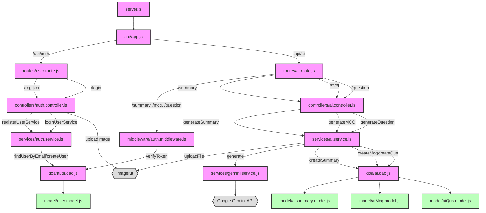

# Backend Flowchart

This flowchart visualizes the request flow in your backend application, from the entry point down to the database models.

graph TD

    %% Entry
    Browser[User Browser] --> NextApp[app/layout.tsx]

    %% Pages
    NextApp --> HomePage[app/page.tsx]
    NextApp --> AuthLayout[(auth)]
    NextApp --> DashboardLayout[(dashboard)]

    AuthLayout --> LoginPage[auth/login/page.tsx]
    AuthLayout --> RegisterPage[auth/register/page.tsx]

    DashboardLayout --> Dashboard[dashboard/page.tsx]
    DashboardLayout --> HistoryPage[dashboard/history/page.tsx]
    DashboardLayout --> ProfilePage[dashboard/profile/page.tsx]

    %% Shared Components
    HomePage --> Navbar[components/navbar.tsx]
    Dashboard --> Sidebar[components/sidebar.tsx]
    HistoryPage --> HistoryItem[components/historyItem.tsx]
    ProfilePage --> ProfileForm[components/profileForm.tsx]
    HomePage --> SummaryCard[components/summaryCard.tsx]

    %% Stores
    NextApp --> UserStore[store/userStore.ts]
    NextApp --> UIStore[store/uiStore.ts]
    SummaryCard --> SummaryStore[store/summaryStore.ts]

    %% React Query
    HistoryPage --> HistoryQuery[hooks/useHistory.ts]
    ProfilePage --> ProfileQuery[hooks/useProfile.ts]
    HomePage --> SummarizeMutation[hooks/useSummary.ts]

    %% API Layer
    HistoryQuery --> Axios[lib/axios.ts]
    ProfileQuery --> Axios
    SummarizeMutation --> Axios

    Axios --> BackendAPI{{Backend API}}

    %% Auth flow
    LoginPage --> AuthService[lib/auth.ts]
    RegisterPage --> AuthService
    AuthService --> UserStore
    UserStore --> Dashboard

    %% Extra UI
    NextApp --> ThemeProvider[components/theme-provider.tsx]
    UIStore --> Sidebar
    UIStore --> Modal[components/modal.tsx]

    %% Styling
    classDef file fill:#f9f,stroke:#333,stroke-width:2px;
    classDef comp fill:#aff,stroke:#333,stroke-width:2px;
    classDef store fill:#ffa,stroke:#333,stroke-width:2px;
    classDef hook fill:#bfb,stroke:#333,stroke-width:2px;
    classDef ext fill:#ddd,stroke:#333,stroke-width:2px;

    class HomePage,LoginPage,RegisterPage,Dashboard,HistoryPage,ProfilePage file;
    class Navbar,Sidebar,ProfileForm,SummaryCard,HistoryItem,Modal comp;
    class UserStore,UIStore,SummaryStore store;
    class HistoryQuery,SummaryMutation,ProfileQuery hook;
    class BackendAPI ext;
